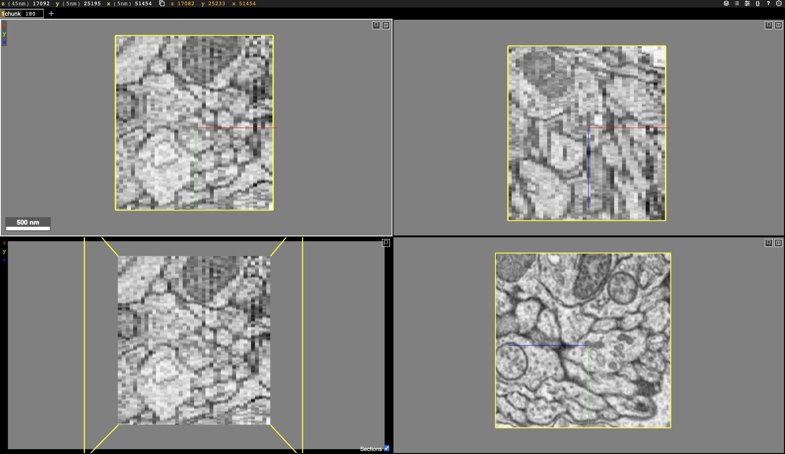
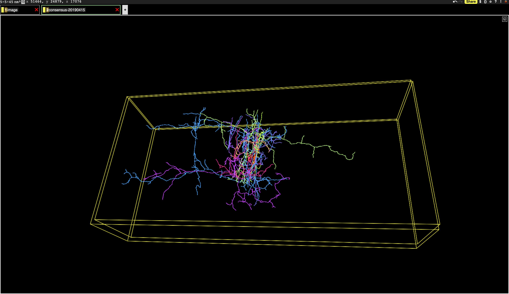

<!--  -->

> **_NOTE:_** You can click the image to visualize the data in your browser and interact with it.

### Image
[](https://neuromancer-seung-import.appspot.com/#!%7B%22layers%22:%5B%7B%22source%22:%22precomputed://gs://neuroglancer/zfish_v1/image%22%2C%22type%22:%22image%22%2C%22opacity%22:0.43%2C%22blend%22:%22default%22%2C%22shaderControls%22:%7B%7D%2C%22name%22:%22image%22%7D%5D%2C%22navigation%22:%7B%22pose%22:%7B%22position%22:%7B%22voxelSize%22:%5B5%2C5%2C45%5D%2C%22voxelCoordinates%22:%5B54746.8125%2C26999.6875%2C16946.53515625%5D%7D%7D%2C%22zoomFactor%22:19.889658834717007%7D%2C%22perspectiveOrientation%22:%5B0.33774635195732117%2C-0.7286133766174316%2C-0.27233976125717163%2C0.5299820899963379%5D%2C%22perspectiveZoom%22:2132.77119684805%2C%22showSlices%22:false%2C%22jsonStateServer%22:%22https://www.dynamicannotationframework.com/nglstate/post%22%2C%22layout%22:%224panel%22%7D)

### Image with Segmentation
[](https://neuromancer-seung-import.appspot.com/#!%7B%22layers%22:%5B%7B%22source%22:%22precomputed://gs://neuroglancer/zfish_v1/image%22%2C%22type%22:%22image%22%2C%22opacity%22:0.43%2C%22blend%22:%22default%22%2C%22shaderControls%22:%7B%7D%2C%22name%22:%22image%22%7D%2C%7B%22source%22:%22precomputed://gs://neuroglancer/zfish_v1/consensus-20190415%22%2C%22type%22:%22segmentation%22%2C%22skeletonRendering%22:%7B%22mode2d%22:%22lines_and_points%22%2C%22mode3d%22:%22lines%22%7D%2C%22name%22:%22consensus-20190415%22%7D%5D%2C%22navigation%22:%7B%22pose%22:%7B%22position%22:%7B%22voxelSize%22:%5B5%2C5%2C45%5D%2C%22voxelCoordinates%22:%5B51461.74609375%2C24880.7734375%2C17072.6640625%5D%7D%7D%2C%22zoomFactor%22:19.889658834717007%7D%2C%22perspectiveOrientation%22:%5B0.33774635195732117%2C-0.7286133766174316%2C-0.27233976125717163%2C0.5299820899963379%5D%2C%22perspectiveZoom%22:2132.77119684805%2C%22showSlices%22:false%2C%22jsonStateServer%22:%22https://www.dynamicannotationframework.com/nglstate/post%22%2C%22selectedLayer%22:%7B%22layer%22:%22consensus-20190415%22%2C%22size%22:460%7D%2C%22layout%22:%224panel%22%7D)

### Neuron Skeletons
[](https://neuromancer-seung-import.appspot.com/#!%7B%22layers%22:%5B%7B%22source%22:%22precomputed://gs://neuroglancer/zfish_v1/image%22%2C%22type%22:%22image%22%2C%22opacity%22:0.43%2C%22blend%22:%22default%22%2C%22shaderControls%22:%7B%7D%2C%22name%22:%22image%22%7D%2C%7B%22source%22:%22precomputed://gs://neuroglancer/zfish_v1/consensus-20190415%22%2C%22type%22:%22segmentation%22%2C%22segments%22:%5B%2276886%22%2C%2277099%22%2C%2277135%22%2C%2277232%22%2C%2277641%22%2C%2277892%22%2C%2277901%22%2C%2277942%22%2C%2278299%22%2C%2278574%22%2C%2281862%22%5D%2C%22skeletonRendering%22:%7B%22mode2d%22:%22lines_and_points%22%2C%22mode3d%22:%22lines%22%7D%2C%22name%22:%22consensus-20190415%22%7D%5D%2C%22navigation%22:%7B%22pose%22:%7B%22position%22:%7B%22voxelSize%22:%5B5%2C5%2C45%5D%2C%22voxelCoordinates%22:%5B51464.59375%2C24879.638671875%2C17076.740234375%5D%7D%7D%2C%22zoomFactor%22:79.55863533886803%7D%2C%22showAxisLines%22:false%2C%22perspectiveOrientation%22:%5B0.010097593069076538%2C-0.9684427380561829%2C0.23213648796081543%2C-0.09016319364309311%5D%2C%22perspectiveZoom%22:4265.5423936961%2C%22showSlices%22:false%2C%22jsonStateServer%22:%22https://www.dynamicannotationframework.com/nglstate/post%22%2C%22selectedLayer%22:%7B%22layer%22:%22consensus-20190415%22%2C%22size%22:460%7D%2C%22layout%22:%223d%22%7D)