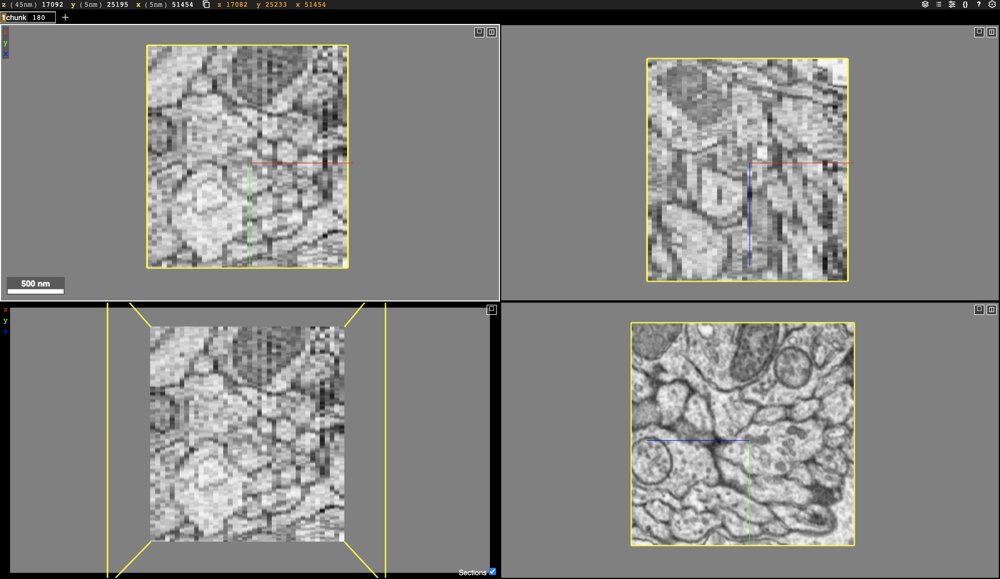

# Access of Data


| Data          | URL |
| -----------   | ----------- |
| image         | gs://neuroglancer/zfish_v1/image |
| segmentation  | gs://neuroglancer/zfish_v1/consensus-20190415   |
| cleft         | gs://neuroglancer/zfish_v1/clefts     |
| skeletons     | https://drive.google.com/drive/folders/1UEb398-fekzqHrhv8JAgszW99Na9aGlK?usp=sharing |
| synapses      | https://drive.google.com/file/d/19R-C1uUHQqwhq6j65AiKk-kWlYkEeaKM/view?usp=sharing |

# Visualization
We use [Neuroglancer](https://github.com/google/neuroglancer) to visualize the image, segmentation, skeleton, and meshes. This is [an example link containing image and segmentation (sparsely proofread)](https://neuromancer-seung-import.appspot.com/#!%7B%22layers%22:%5B%7B%22source%22:%22precomputed://gs://neuroglancer/zfish_v1/image%22%2C%22type%22:%22image%22%2C%22opacity%22:0.43%2C%22blend%22:%22default%22%2C%22shaderControls%22:%7B%7D%2C%22name%22:%22image%22%7D%2C%7B%22source%22:%22precomputed://gs://neuroglancer/zfish_v1/consensus-20190415%22%2C%22type%22:%22segmentation%22%2C%22skeletonRendering%22:%7B%22mode2d%22:%22lines_and_points%22%2C%22mode3d%22:%22lines%22%7D%2C%22name%22:%22consensus-20190415%22%7D%5D%2C%22navigation%22:%7B%22pose%22:%7B%22position%22:%7B%22voxelSize%22:%5B5%2C5%2C45%5D%2C%22voxelCoordinates%22:%5B51461.74609375%2C24880.7734375%2C17072.6640625%5D%7D%7D%2C%22zoomFactor%22:19.889658834717007%7D%2C%22perspectiveOrientation%22:%5B0.33774635195732117%2C-0.7286133766174316%2C-0.27233976125717163%2C0.5299820899963379%5D%2C%22perspectiveZoom%22:2132.77119684805%2C%22showSlices%22:false%2C%22jsonStateServer%22:%22https://www.dynamicannotationframework.com/nglstate/post%22%2C%22selectedLayer%22:%7B%22layer%22:%22consensus-20190415%22%2C%22size%22:460%7D%2C%22layout%22:%224panel%22%7D). 
More example links are in the [Gallery](http://zebrafish.brain-map.github.io/) page. Synapses can also be visualized using Neuroglancer with some customized code.


# Downloading 
For Google Drive links, the data could be downloaded directly by clicking the links.

For image and segmentation volumes in Google Cloud Storage, you can cutout some chunks using [CloudVolume](https://github.com/seung-lab/cloud-volume) or [chunkflow](https://github.com/seung-lab/chunkflow)(still using CloudVolume under the hood). For whole dataset downloading, it is recommended to contact us first.

> **_NOTE:_** CloudVolume use f-order (XYZ) while chunkflow use c-order (ZYX) in default!

> **_NOTE:_** https should be used to avoid using credential files.

Example code to cutout an image chunk using CloudVolume:
```python
from cloudvolume import CloudVolume

vol = CloudVolume('precomputed://gs://neuroglancer/zfish_v1/image', use_https=True)
img = vol[51267:51367, 24985:25085, 17072:17172]
```

Example commandline to cutout an image chunk using chunkflow. This command also saves the image chunk to local disk as a HDF5 file and visualize it using Neuroglancer.
```bash
chunkflow load-precomputed -v precomputed://gs://neuroglancer/zfish_v1/image --use-https --chunk-start 17072 24985 51267 --chunk-size 40 400 400 save-h5 -f image.h5 neuroglancer
```

After that you should see a link in the terminal. Click the link, you should see the image volume visualized in webbrowser. 
> **_NOTE:_** If the link is something like http://c02cq0glmd6v.fios-router.home:55676/v/29bd625ab5c364d68ad9f9f37b58a5444d64de56/, try to replace the `c02cq0glmd6v.fios-router.home` with `localhost`.


